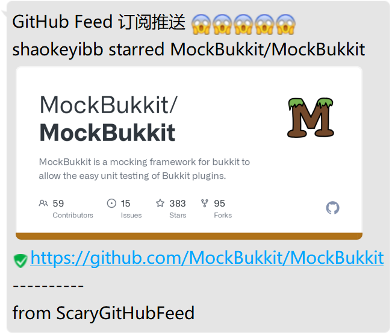

# ScaryGitHubFeed 😱😱😱😱😱

实时推送用户的 GitHub 动态到 QQ 群

## 指令
父权限节点：`io.hikarilan.scarygithubfeed.command.github-feed`
- /github-feed add [GitHubID] 为当前 QQ 群添加 GitHub ID 为 [GitHubID] 用户的动态;
- /github-feed remove [GitHubID] 为当前 QQ 群移除 GitHub ID 为 [GitHubID] 用户的动态;
- /github-feed list 列出当前 QQ 群的已订阅 GitHub 用户列表;

## License
ScaryGitHubFeed is license under [AGPLv3](LICENSE.txt).
